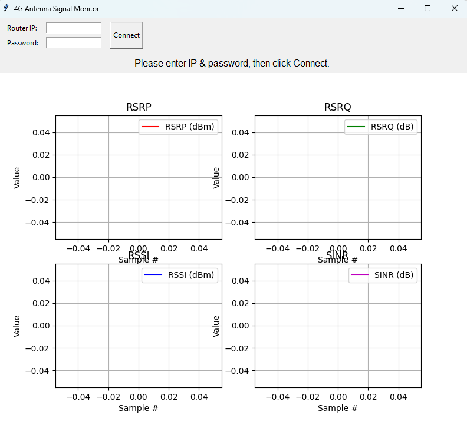

# 4G Antenna Signal Monitor

## Overview

This software monitors and records the performance of a 4G antenna when connected to a Huawei router. It provides real-time signal metrics and saves the data to a CSV file for further analysis. The application includes a graphical user interface (GUI) built with Tkinter and plots the signal metrics using Matplotlib.

## Features

- Real-time monitoring of signal metrics (RSRP, RSRQ, RSSI, SINR).
- Connection to a Huawei router using IP address and password.
- Data visualization with dynamic plots for each signal metric.
- Automatic recording of signal data into a CSV file for analysis.
- User-friendly GUI for ease of use.

## Prerequisites

- Python 3.7 or later
- A Huawei router with API support

## Required Libraries

Install the following Python libraries before running the program:

- `huawei-lte-api`
- `tkinter` (comes pre-installed with Python)
- `matplotlib`
- `numpy`

You can install the required libraries using pip:
```bash
pip install huawei-lte-api matplotlib numpy
```

## Usage

1. Clone the repository:
   ```bash
   git clone <repository_url>
   ```

2. Navigate to the project directory:
   ```bash
   cd <project_directory>
   ```

3. Run the program:
   ```bash
   python <script_name>.py
   ```

4. Enter the IP address and password of your Huawei router in the GUI and click **Connect**.

5. View real-time signal metrics and plots in the GUI. Data will be saved in `signal_data.csv`.

## CSV Output

The signal metrics are saved in `signal_data.csv` with the following headers:

- Timestamp
- RSRP (dBm)
- RSRQ (dB)
- RSSI (dBm)
- SINR (dB)
- PCI
- Cell ID
- Band
- DL Bandwidth
- UL Bandwidth

## Graphical Interface

The GUI consists of:

- **Connection Frame**: Input fields for the router IP and password, and a Connect button.
- **Signal Metrics Info**: A textual display of the current signal metrics.
- **Plots**: Dynamic plots for RSRP, RSRQ, RSSI, and SINR.



## Limitations

- The program assumes the router uses the default username `admin`.
- Only the most recent 50 data points are displayed in the plots.
- Connection errors or invalid credentials will display error messages in the GUI.

## License

This project is licensed under the GPL-3.0 license. See the LICENSE file for details.
